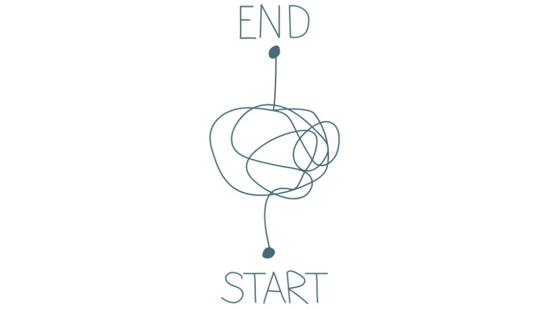

# Orientierungshilfe zur Anfertigung einer wissenschaftlichen Hausarbeit im Fach Philosophie

## Die philosophische Hausarbeit als Prüfungsformat

Eine Hausarbeit ist in der Regel eine systematische und ausführliche Abhandlung, die sich mit einem philosophischen  Problem bzw. einer philosophischen Fragestellung auseinandersetzt. Dabei sollen Studierende zeigen, dass sie in der Lage sind, ein philosophisches Problem eigenständig zu erfassen, darzustellen und mithilfe philosophischer Methoden zu bearbeiten, um zu einem plausibel begründeten Ergebnis zu gelangen.

Der Zweck der Hausarbeit besteht darin, das wissenschaftliche Schreiben zu trainieren. Dies schließt eine selbstständige und fundierte Auseinandersetzung mit philosophischen Themen und Positionen ein, die aus einer gründlichen Beschäftigung und kritischen Auseinandersetzung mit der im Seminar behandelten Primärliteratur sowie relevanter Fachliteratur folgt und nicht allein auf Basis eigener Überlegungen vollzogen wird. Ihre eigene Meinung ist von Bedeutung, allerdings müssen Sie sie gut begründen. Es geht bei einer wissenschaftlichen philosophischen Hausarbeit nicht primär darum, die eigene Meinung bloß mitzuteilen, sondern darum, andere durch Argumente von ihr zu überzeugen.

## I. Themenwahl und Vorbereitung

Wählen Sie ein Thema, das Sie interessiert und gleichzeitig Raum für eigene Einordnungen und Argumentationsansätze bietet. Das Thema Ihrer Hausarbeit sollte thematisch im Rahmen des jeweiligen Seminars liegen. Idealerweise wählen Sie es selbst aus und besprechen es mit dem Seminarleiter oder der Seminarleiterin. Im besten Fall dient die geplante Hausarbeit der Vertiefung eigener fachlicher Interessen.

Überlegen Sie sich, welcher Themenbereich oder welche im Seminar besprochenen Schwerpunkte Sie interessieren.

- Wenn Sie sich für einen Themenbereich entschieden haben und innerhalb dieses Bereichs nach einem passenden Thema suchen, kann es hilfreich sein, aktuelle Forschungsliteratur (Monografie, Sammelband, relevante Aufsätze) zu diesem Thema zu lesen. Dabei verschaffen Sie sich nicht nur einen Überblick über den aktuellen Forschungsstand, sondern können auch Fragestellungen, Kontroversen oder Ansätze identifizieren, die Ihnen als Ausgangspunkt für Ihre eigene Arbeit dienen könnten. Achten Sie darauf, unterschiedliche Perspektiven zu berücksichtigen, um ein möglichst breites Verständnis des Themenbereichs zu entwickeln.

- Beim Lesen sollten Sie nicht allein darauf achten, welche spezifischen Fragestellungen Ihr Interesse wecken, sondern auch, an welchen Stellen Ihnen der Verfasserin bzw. des Verfassers schwer nachvollziehbar oder möglicherweise fehlerhaft erscheint. Solche Textstellen geben häufig eine gute Grundlage für die Inspiration einer eigenen Ausgangsthese.

- Das Thema Ihrer Hausarbeit sollte klar eingegrenzt und nicht zu breit gefasst sein. Es sollte grundsätzlich eine eng umrissene Fragestellung gründlich bearbeitet werden als eine weitläufige oder offene Fragestellung, die i.d.R. im Rahmen einer Hausarbeit nur eine oberflächliche Untersuchung erlaubt.

Formulieren Sie dazu eine zentrale Hauptfrage, die die Grundlage Ihrer Arbeit bildet.  Achten Sie dabei stets auf Ihre These, die nicht trivial sein sollte.

- Bietet A eine überzeugende Lösung für das Problem X?
- A schlägt Lösung M für Problem X vor, während B Lösung N vorschlägt. Welche dieser Lösungen sind aus welchen Gründen überzeugender?
- Ist die Kritik von A an der Theorie T stichhaltig?
- Wie ist die Textstelle Y im Werk von A genau zu interpretieren?
- A und B deuten die Textstelle Y auf völlig unterschiedliche Weise. Welche Argumente sprechen für die Interpretation von A, welche für die von B?

## II. Themenabsprache

Es wird allgemein empfohlen, das Thema und die Vorgehensweise im Vorfeld mit der Lehrperson abzustimmen. In einigen Fällen wird dies sogar explizit verlangt. Ob die Absprache in Form einer Sprechstunde, via E-Mail oder eines Telefonats erfolgt, ist stets individuell abzusprechen.

Je nach Lehrperson kann ein Exposé als Grundlage für eine solche Absprache obligatorisch oder fakultativ sein. Ein Exposé einer wissenschaftlichen Arbeit dient dazu, das geplante Forschungsvorhaben klar und strukturiert darzulegen. Es bietet einen Überblick über das Thema, die zentrale Fragestellung, die Zielsetzung sowie die methodische Vorgehensweise der Arbeit. Zudem enthält es oft eine kurze Darstellung des Forschungsstandes und eine grobe Gliederung.

Sollte Ihnen die Anfertigung eines Exposés offen gestellt sein, denken Sie dennoch daran, dass die Vorteile eines Exposés zu Ihren Gunsten ausfallen;

- Klarheit und Struktur: Es hilft, das Thema, die Fragestellung und den Forschungsansatz präzise zu formulieren und zu strukturieren.
- Zielorientierung: Durch die Festlegung von Zielen und Methoden wird das Arbeiten zielgerichteter und effizienter.
- Feedback-Möglichkeit: Das Exposé und auch die Themenabsprache im Allgemeinen ermöglicht es, frühzeitig Rückmeldungen zu erhalten und das Vorhaben gegebenenfalls anzupassen.
- Zeitplanung: Es unterstützt bei der Planung des Arbeitsablaufs und hilft, Zeitrahmen für die einzelnen Arbeitsschritte festzulegen.
- Problemerkennung: Durch die frühzeitige Auseinandersetzung mit dem Thema lassen sich mögliche Schwierigkeiten oder Lücken in der Argumentation frühzeitig erkennen.
- Motivation und Orientierung: Ein gut durchdachtes Exposé dient als Leitfaden während der Schreibphase und verhindert, dass man sich vom eigentlichen Thema entfernt.

## III. Literatur: Auswahl und Suche

**Umgang mit Primär-und Forschungsliteratur**

Fassen Sie Sekundärliteratur keinesfalls einfach nur zusammen, sondern nutzen Sie sie als Ausgangspunkt für eine eigenständige Argumentation sowie zur Unterstützung Ihrer eigenen Thesen.

Um die Anforderungen an wissenschaftliches Arbeiten zu erfüllen, sollten Sie in Ihrer Hausarbeit grundsätzlich nur  zitier würdige Literatur verwenden. Das bedeutet, dass ausschließlich wissenschaftliche und glaubwürdige Quellen herangezogen werden dürfen. Gehen Sie dabei kritisch vor, indem Sie tragfähige Gegenargumente zu allen Überzeugungen in Betracht ziehen. Lesen und interpretieren Sie Texte im besten möglichen Licht (im Sinne des „Principle of Charity“), begründen Sie Ihre Urteile sorgfältig und geben Sie alle verwendeten Quellen präzise an. Es muss für Ihre Leser*innen jederzeit nachvollziehbar sein, ob Sie fremde Texte paraphrasieren oder Ihre eigenen Gedanken darstellen. Achten Sie dabei stets auf wissenschaftliche Redlichkeit und Integrität. Im Kapitel „VI Zitation“ wird ausführlich erläutert, wie Forschungsliteratur konkret und korrekt in die eigene Arbeit integriert wird.

Da das Schreiben einer wissenschaftlichen Hausarbeit in der Regel über einen längeren Zeitraum erfolgt und die Primär- und Sekundärliteratur oft in Etappen gesichtet wird, empfiehlt es sich, Exzerpte zu den gelesenen Werken anzufertigen. Diese Exzerpte bieten Ihnen während des Schreibprozesses eine hilfreiche Übersicht über die zentralen Inhalte und sorgen für Orientierung. Wie Sie Ihre Exzerpte gestalten, bleibt Ihnen überlassen. Es stehen Ihnen verschiedene Methoden dafür zur Auswahl, z.B.

- PLATO-Methode
- Ausführliche Zusammenfassung der wichtigsten Textabschnitte und -stellen
- Concept Maps
- Literaturverwaltungsprogramme wie Citavi, Zotero o.Ä.
- …

**Literatursuche**

Eine erfolgreiche Literatursuche kombiniert die Nutzung von Bibliotheken, spezialisierte Datenbanken und Enzyklopädien mit einem gezielten Vorgehen. Primärliteratur bildet dabei das Fundament, während Sekundärliteratur zur Analyse, Diskussion und Einordnung dient. 
Hier sind wichtige Schritte und Orte, um relevante Forschungsliteratur zu finden:

- Klassische Werke und Primärtexte

  - Arbeiten Sie mit Originaltexten der behandelten Philosoph*innen (Primärliteratur).
  - Nutzen Sie kritische Editionen oder zuverlässige Übersetzungen, oft verfügbar in Bibliotheken oder digitalen Archiven.

- Sekundärliteratur und Forschungsliteratur

  - Aktuelle Monografien, Sammelbände oder Fachzeitschriften liefern Analysen, Interpretationen und Forschungskontroversen zu Ihrem Thema.
  - Suchen Sie gezielt nach Rezensionen in Fachzeitschriften, um die Relevanz von Literatur einzuschätzen.

- Orientierung und Grundlagenarbeit

  - Philosophische Nachschlagewerke und Enzyklopädien: Diese bieten Überblickswissen und Orientierung zu zentralen Begriffen, Theorien oder Philosoph*innen. Beispiele: Stanford Encyclopedia of Philosophy, Routledge Encyclopedia of Philosophy
  - Einführungswerke und Handbücher: Diese bieten eine erste Einführung in das Thema und Literaturhinweise für vertiefende Werke. Beispiele: Reihen wie Grundrisse der Philosophie oder Metzler Handbuch.

- Gezielte Literaturrecherche

  - Verwenden Sie Schlagworte und Suchbegriffe systematisch: Variieren Sie Synonyme oder kombinieren Sie Begriffe logisch (z.B. mit AND/OR).
  - Nutzen Sie Filtermöglichkeiten in Datenbanken (z.B. Veröffentlichungsjahr, Autor, Sprache, Peer-Reviewed).
  - Durchsuchen Sie die Literaturlisten relevanter Werke, um weiterführende Quellen zu finden.

  - Bibliothekskataloge: Nutzen Sie Universitätsbibliotheken oder nationale Bibliotheksverbünde.

    - Karlsruher Virtueller Katalog (KVK)

    - Deutsche Nationalbibliothek

    - Lokale Bibliothekskataloge (z.B. OPAC).

  -   Fach-Datenbanken für Philosophie:

    - PhilPapers – umfassende Plattform für philosophische Artikel und Literatur.

    - JSTOR – Archiv für wissenschaftliche Journals, darunter viele philosophische Texte.

    - ProQuest oder EBSCOhost – interdisziplinäre Plattformen mit philosophischen Inhalten.

    - Elektronische Zeitschriftenbibliotheken (EZB): Zugriff auf wissenschaftliche Fachzeitschriften, oft über Universitäten.

  - Google Scholar: Für die Suche nach wissenschaftlichen Aufsätzen und Büchern, inklusive Zitierungen.

  - Dissertationen und Forschungsarbeiten: Oft auf Plattformen wie d-nb.info (Deutsche Dissertationen) oder ProQuest Dissertations & Theses.

## IV. Gliederung

Eine wissenschaftliche Arbeit setzt eine klare und präzise Gliederung voraus, die idealerweise vor dem eigentlichen Schreibprozess entwickelt wird. Zwar können sich einzelne Gliederungspunkte während des Schreibens verändern, solche Anpassungen sollten jedoch stets auf der Grundlage einer bereits vorhandenen Struktur des gesamten Textes erfolgen.

**Formale Gliederung der Arbeit**

- Deckblatt: Titel der Arbeit, Name, Studiengang und Matrikelnummer  
([Musterdeckblatt](Mustertitelblatt.pdf))

- Inhaltsverzeichnis: Mit allen Überschriften und den zugehörigen Seitenzahlen 

- Einleitung: Interesse wecken, Fragestellung und These vorstellen, Gliederung erläutern

- Hauptteil: In mehrere Kapitel und ggf. Unterkapitel untergliedert

- Schluss: Zusammenfassung und ggf. Ausblick

- Literaturverzeichnis: Alle in der Arbeit zitierten Quellen (und nur diese!)

- Eigenständigkeitserklärung: Eine unterschriebene Erklärung zur selbstständigen Anfertigung der Arbeit
([Eigenständigkeitserklärung](_Eigenstaendigkeitserklaerung_philsem_1123.pdf))

**Der Aufbau des Textes lässt sich in drei Hauptteile gliedern:**

**Einleitung:**

- Die Einleitung führt in das Thema ein, weckt das Interesse der Leser*innen und entwickelt die zentrale Fragestellung sowie die These oder Zielsetzung der Arbeit. Sie sollte folgende Punkte enthalten:
- Worum geht es? (Thema und Fragestellung)
- Warum ist das Thema relevant? (nur falls passend, z.B. durch Bezug auf größere philosophische Projekte)
- Wie wird methodisch vorgegangen? (Gliederung der Arbeit)
- Dabei sollten biografische Informationen zur Autorin oder Allgemeinplätze vermieden werden. Persönliche Meinungen oder subjektive Bezüge zum Thema gehören nicht in die Einleitung. Als Faustregel gilt: Die Einleitung sollte nicht mehr als 10 % des gesamten Textumfangs ausmachen.

**Hauptteil:**

Der Hauptteil bildet das Zentrum der Arbeit und folgt logisch der zuvor formulierten Fragestellung. Alle relevanten Gedankenschritte zur Beantwortung der Frage müssen hier schlüssig und strukturiert dargestellt werden, während nebensächliche Punkte weggelassen werden.

- Darstellung des Themas: Erläuterung zentraler Begriffe, Theorien oder Positionen, die für die Fragestellung relevant sind.
- Argumentative Auseinandersetzung: Entwicklung der eigenen Argumentation durch kritische Analyse und Diskussion der zugrundeliegenden Texte. Dabei gilt es, Einwände zu begründen und überzeugende Gegenargumente zu prüfen.
- Gedankliche Übergänge: Zwischen einzelnen Kapiteln sollten klare Verbindungen geschaffen werden, etwa durch kurze Resümees der bisherigen Inhalte, die zur Zielsetzung des nächsten Abschnitts überleiten.

Im Hauptteil ist es unerlässlich, der logischen Hierarchie von These, Argument und Beispiel zu folgen:

- **These:**

  Eine klare Aussage, die belegbar oder widerlegbar ist.

- **Argument:**

  Stützt die These und muss in einer textbasierten Wissenschaft wie der Philosophie immer am Originaltext nachgewiesen werden.

- **Beispiel**

  Veranschaulicht die Argumentation und macht sie überprüfbar. Beispiele können auch außerhalb des Werkes des behandelten Autors bzw. der behandelten Autorin liegen, was zeigt, dass die zugrundeliegende Philosophie anwendungsfähig und robust ist.

**Schluss:**

Der Schlussteil fasst die zentralen Schritte des Gedankengangs sowie die wichtigsten Ergebnisse der Arbeit prägnant zusammen. Neue inhaltliche Punkte sollten hier nicht eingeführt werden. Falls passend, kann der Schluss einen kurzen Ausblick auf noch offene Fragen oder weitere Diskussionsmöglichkeiten bieten.

## V. Editorische Vorgaben
 

Für die Formatierung empfiehlt es sich, die folgenden Hinweise zu beachten, wenn nicht anders und individuell mit der/dem Dozent:in vereinbart. 

- Das Inhaltsverzeichnis sollte klar strukturiert und einheitlich formatiert sein. Die Überschrift „Inhaltsverzeichnis“ wird i.d.R. linksbündig gesetzt. Die Gliederung kann bspw. in dezimaler Nummerierung, beispielsweise „1“, „1.1“ oder „1.1.1“,erfolgen. Jede Unterebene wird entsprechend eingerückt, um die Hierarchie der Kapitel deutlich zu machen. 

  Die Schriftart und -größe sollten mit dem restlichen Dokument übereinstimmen. Die Seitenzahlen der einzelnen Kapitel und Unterkapitel werden rechtsbündig ausgerichtet, wobei sie durch eine Reihe von Punkten oder Leerzeichen von der Überschrift getrennt sind. Alle Überschriften im Inhaltsverzeichnis müssen exakt mit denen im Text übereinstimmen.

  Um Fehler zu vermeiden und die Übersichtlichkeit zu gewährleisten, empfiehlt es sich, die automatische Funktion für Inhaltsverzeichnisse in Textverarbeitungsprogrammen zu nutzen. So bleibt das Verzeichnis professionell und gut lesbar.

- Absätze werden nicht durch Leerzeichen gesetzt. Nutzen Sie dafür die Absatzformatierungen Ihres Textverarbeitungsprogramms oder passen Sie diese ggf. individuell an.

- Zwischen Anführungszeichen („) und Abführungszeichen (“)unterscheiden! Anführungszeichen markieren den Anfang eines direkten Zitats und Abführungszeichen schließen dieses ab. Zitieren Sie ein Zitat, in dem bereits zitiert wird, dann nutzen Sie die einfachen Anführungszeichen für das Zitat im Zitat. 
  
  Beispiel: Ebenfalls muss hier festgehalten werden, dass beide in ihrer letzten Konsequenz zwei Grundtriebe darstellen, die wie eine „determinierende Kraft, die den Lebensprozessen eine bestimmte ‚Richtung‘ gibt, im Sinne von ‚Lebensprinzipien‘“[^1] wirken.
  
  
- Fußnoten können mit der Fußnotenautomatik des Textverarbeitungsprogramms konfiguriert werden.

- Falls notwendig, den typografischen Apostroph verwenden: ’ (im Gegensatz zu ').

- Falls Sie sich in Ihrer Arbeit dazu entscheiden, zu gendern, dann achten Sie auf Einheitlichkeit. 

- Unterscheiden Sie zwischen einem Viertelgeviertstrich und Halbgeviertstrich bzw. Binde- und Gedankenstrich. Der Unterschied zwischen Bindestrich und Gedankenstrich liegt in der Schreibweise und ihren Verwendungszwecken.

  Der Bindestrich: (- ; kurz) wird etwa verwendet für: 

  - Zusammensetzungen mit Abkürzungen, Wortgruppen, Ziffern und Zeichen zu bilden
  - Wortbedeutungen hervorzuheben
  - Ergänzungen von Wörtern anzuzeigen
  - Wörter am Zeilenende zu trennen

  Der Gedankenstrich (–- ; lang) wird etwa verwendet für: 

  - Einschübe in Sätzen
  - bei Anhängen 
  - Als Minuszeichen 
  - Als Zeichen für das Wort „bis“ (z.B. zwischen Seitenzahlen)

- Mit Hervorhebungen sollte im Text sparsam und einheitlich umgegangen werden (Unterstreichungen, Fettierungen, Kursivierung - i.d.R. keine Kapitälchen).

- Aufzählungen können mit Gedankenstrichen, Punkten, Buchstaben oder Ziffern markiert werden. Auch hier muss die Einheitlichkeit eingehalten werden.

- Bei Adjektivierungen von Eigennamen muss auf die richtige Schreibweise geachtet werden. Richtig sind folgende Versionen: hegelsche (klein und ohne Apostroph) und Hegel’sche (groß, mit Apostroph). Nicht mehr üblich ist die Variante Hegelsche (groß, ohne Apostroph).

[^1]: Herbert Marcuse, Triebstruktur und Gesellschaft. Ein philosophischer Beitrag zu Sigmund Freud, in: Herbert Marcuse, Schriften, Band 5, Frankfurt am Main: Suhrkamp Verlag 1970, S.32.

## VI. Zitation

Die korrekte Zitation in einer philosophischen Hausarbeit ist unerlässlich, um wissenschaftliche Redlichkeit zu gewährleisten, die Nachvollziehbarkeit der Argumentation sicherzustellen und Plagiate zu vermeiden.

**Grundprinzipien der Zitation**

- Transparenz: Jede fremde Idee, jedes Zitat oder jede Paraphrase muss klar als solche gekennzeichnet werden.
- Nachvollziehbarkeit: Die verwendeten Quellen müssen für Leser*innen eindeutig auffindbar sein.
- Einheitlichkeit: Eine einmal gewählte Zitationsweise sollte konsequent in der gesamten Arbeit beibehalten werden.

**Zitationsweise**

In der Philosophie werden vor allem zwei Zitationsweisen verwendet. Welches System zu verwenden ist, hängt häufig von den Vorgaben Ihrer Universität oder Ihres Dozenten ab. Konsistenz innerhalb der Arbeit ist entscheidend.

- Deutsche Zitierweise (Fußnoten)
  
  - Die Quellenangabe erfolgt in einer Fußnote am unteren Seitenrand.

    Bei der ersten Nennung wird die vollständige Literaturangabe genannt:

    Beispiel:

    Autor, Titel, Erscheinungsort, Erscheinungsjahr, Seitenangabe.

    Bei wiederholter Nennung derselben Quelle kann eine Kurzform verwendet werden:

    Beispiel: Autor, Kurztitel, Seitenangabe.

- Harvard-Zitation (Kurzverweis im Text)
  - Die Quellenangabe erfolgt in Klammern direkt im Text:

      Beispiel: (Autor Jahr, Seitenzahl).

      Am Ende der Arbeit wird die vollständige Angabe im Literaturverzeichnis gemacht.

**Korrektes Zitieren:**

Je nach Publikation gelten folgende Richtlinien:
  
- Monographien:
  
  Vorname Nachname, Titel. Untertitel, herausgegeben von Vorname Nachname (falls zutreffend), Erscheinungsort, Auflage (falls vorhanden), Erscheinungsjahr, Seite.

- Bände aus Gesamtausgaben:  

   Nach dem Untertitel wird ergänzt: Gesamtausgabe, Bandnummer, herausgegeben von Vorname Nachname.

- Aufsätze in Sammelbänden:

  Vorname Nachname, Titel. Untertitel, in: Vorname Nachname/Vorname Nachname (Hrsg.), Titel des Sammelbandes, Erscheinungsort, Auflage (falls vorhanden), Erscheinungsjahr, Seitenzahlen: zitierte Seite.

- Aufsätze in Zeitschriften:

  Vorname Nachname, Titel. Untertitel, in: Name der Zeitschrift, Jahrgangsnummer (Erscheinungsjahr), Seitenzahlen: zitierte Seite.

- Artikel in einem Lexikon:

   Vorname Nachname, Titel des Artikels, in: Name des Lexikons, herausgegeben von Vorname Nachname, Bandnummer, Erscheinungsort, Auflage (falls vorhanden), Erscheinungsjahr, Seiten- oder Spaltenangabe: zitierte Seite/Spalte.
  
  **Zitationsform**  

- Direkte Zitate

  Definition: Der exakte Wortlaut einer Textstelle wird übernommen.
  
  Kennzeichnung: Direkte Zitate werden in Anführungszeichen gesetzt.

  Quellenangabe: Bei direkten Zitaten ist die genaue Seitenzahl zwingend erforderlich.

  Hervorhebungen: Wenn Hervorhebungen (z.B. Fettdruck oder Kursivierung) hinzugefügt oder weggelassen werden, muss dies kenntlich gemacht werden:

  Hervorhebung im Originaltext, dann wird in der Quellenangabe folgendes angegeben: „Hervorhebung im Original“

  Eigene Hervorhebung, dann wird in der Quellenangabe folgendes angegeben: „Hervorhebung d. Verf.“ – Man kann stattdessen aber auch die eigenen Initialien angeben; „Hervorhebung v. M.M. (Maxime Mustermann)

  Auslassungen: „Der Satz ist […] Ausdrucksform des Gedankens“ (ebd.).

  Beispiel:

  Der Irrglaube aber vom Menschen, der durch diese höheren Stufen „schrittweise vom Sklaven zum Herrn der Natur“  wurde, enttarnt Weil als sein Gegenteil. [^2]

  
- Paraphrasen (Indirekte Zitate) am Beispiel der Harvard-Zitation:

  Wichtig: Auch bei Paraphrasen ist die genaue Seitenzahl anzugeben, da sie sich auf konkrete Textstellen beziehen.

  Definition: Der Inhalt eines fremden Gedankens wird sinngemäß und in eigenen Worten wiedergegeben.

  Kennzeichnung: Paraphrasen werden nicht in Anführungszeichen gesetzt, jedoch muss die Quelle genannt werden.

  Quellenangabe: In der Fußnote oder in Klammern nach der Paraphrase.

  Beispiel:
  Simone Weil führt weiter aus, dass der Mensch in großen Teilen über die Natur herrschen mag, er jedoch der Sklave *seiner* Natur bleibt. [^3]

[^2]: Simone Weil, Über die Ursachen von Freiheit und gesellschaftlicher Unterdrückung, Zürich3: Diaphanes Verlag 2021, S. 40.
[^3]: Vgl. Weil, Über die Ursachen von Freiheit, 40f.

## VII. Sprache und Stil

Der Stil und die Sprache einer philosophischen Hausarbeit folgen bestimmten Regeln, die sich an den Anforderungen wissenschaftlichen Schreibens orientieren. In der Philosophie kommt es vor allem darauf an, präzise, klar und nachvollziehbar zu argumentieren, wobei die Sprache zugleich sachlich und formal sein muss.

**Besonderheiten des philosophischen Schreibens**

  - Argumentative Strenge: In der Philosophie sind Begründungen zentral. Jeder Schritt Ihrer Argumentation muss klar begründet und nachvollziehbar sein. Beispiele und Belege helfen dabei, Ihre Aussagen zu untermauern.

  - Genauigkeit bei Textinterpretationen: Achten Sie auf exakte Textstellen und deren Kontext. Interpretieren Sie keine Aussagen hinein, die der Autor nicht gemacht hat.

  - Kritische Auseinandersetzung: Zeigen Sie nicht nur Verständnis für die Positionen anderer Autor*innen, sondern prüfen Sie sie kritisch und wägen Sie Einwände ab.

  **Besonderheiten des wissenschaftlichen Schreibens im Allgemeinen**

- Sachlichkeit und Neutralität:
  
  Vermeiden Sie emotionale Ausdrücke, wertende Formulierungen oder subjektive Einschätzungen wie „Ich finde“ oder „Meiner Meinung nach“. Stattdessen sollte Ihre Argumentation logisch, nachvollziehbar und auf Textgrundlagen gestützt sein.

- Objektivität:

   Vermeiden Sie persönliche Kommentare oder unsachliche Meinungsäußerungen. Stattdessen sollten Argumente und Quellen im Zentrum stehen.

- Präzision und Klarheit:

  Formulieren Sie so eindeutig wie möglich. Vermeiden Sie umgangssprachliche oder mehrdeutige Begriffe und formulieren Sie Sätze prägnant. In der Philosophie zählt jede Nuance; unklare Formulierungen können zu Missverständnissen führen.

    Beispiele:

  <ins>Nicht präzise:</ins>

  „Kant hat irgendwie eine Meinung dazu, dass Moral und Vernunft wichtig sind.“

  <ins>Präzise:</ins>

  „Kant argumentiert, dass die Moral aus der praktischen Vernunft entspringt, welche autonom Gesetze für das Handeln setzt.“

- Formaler Sprachgebrauch
  - Verwendung der dritten Person: Wissenschaftliche Arbeiten werden nicht in der Ich-Perspektive verfasst. Statt „Ich werde zeigen“ schreiben Sie besser „Es wird gezeigt“ oder „Diese Arbeit zeigt …“.

  - Vermeidung von Umgangssprache und Füllwörtern: Wörter wie „sozusagen“, „irgendwie“, „total“ oder „eigentlich“ gehören nicht in eine wissenschaftliche Arbeit. Auch rhetorische Fragen sollten vermieden werden.

  - Fachsprache und Definitionen: Verwenden Sie präzise Begriffe, die in der Philosophie gängig sind. Falls notwendig, definieren Sie spezielle Begriffe oder Konzepte, um sicherzustellen, dass sie korrekt verstanden werden.

  - Verwendung von Konjunktiv und indirekter Rede: Wenn fremde Positionen referiert werden, nutzen Sie häufig den Konjunktiv oder indirekte Rede, um Distanz zu schaffen und Neutralität zu wahren.

## VIII. Literaturverzeichnis

 

Am Ende der Hausarbeit müssen alle zitierten Quellen in einem Literaturverzeichnis vollständig und alphabetisch sortiert aufgeführt werden. Die genaue Form hängt vom gewählten Zitationsstil ab. Beispiel für die häufige deutsche Zitierweise:

- Monographie:

  Weil, Simone (2021): Über die Ursachen von Freiheit und gesellschaftlicher Unterdrückung, 3. Auflage, Zürich: Diaphanes Verlag.

- Aufsatz in einem Sammelband:

  Habermas, Jürgen (1994): Handlungsrationalität und gesellschaftliche Rationalisierung, in: Dieter Thoma, Dieter (Hrsg.), Philosophische Theorien der Rationalität, Frankfurt a.M.: Suhrkamp, S. 35–67.

- Zeitschriftenartikel:

  Rawls, John (1971): Justice as Fairness, in: Philosophical Review 20 (2), S. 45–72.

## IV. Literaturempfehlungen

Bünting, Karl-Dieter/Bitterlich, Alex/Pospiech, Ulrike: Schreiben im Studium mit Erfolg. Ein Leit- faden. Berlin 2000.

Eco, Umberto: Wie man eine wissenschaftliche Abschlussarbeit schreibt. Doktor-, Diplom- und Magisterarbeit in den Geistes- und Sozialwissenschaften. Übers. v. Walter Schick. Heidelberg 2002.

Schneider, Wolf: Deutsch für Kenner. Die neue Stilkunde. München 2004.

**Weitere hilfreiche Tipps zur Anfertigung wissenschaftlicher Prüfungsleistungen am Philosophischen Seminar finden Sie unter dem folgenden Link: https://lms.uni-kiel.de/url/RepositoryEntry/4346544132

